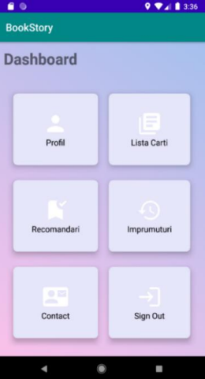
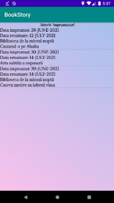
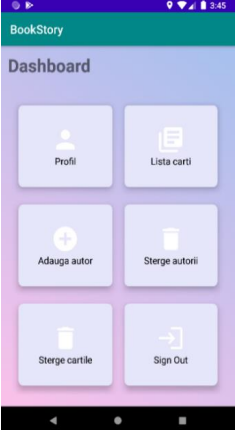
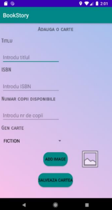
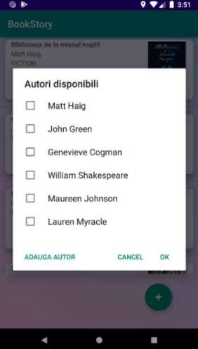

## The app allows the user to:
* Log in /create an account

  
* View a menu of options he has in the app
  

  
* View a list of available books to borrow, search for a specific book, and mark books for borrowing

* View / Change his own profile data

* See the history of the book lends he made

  
* See a list of reccomended books based on his previous lendings

  
## The administrator has the following possibilities
* See a menu of the available options he has

* Add a book and associate existing authors
 
  

* Add an author to the database
* Delete books/authors from the database
