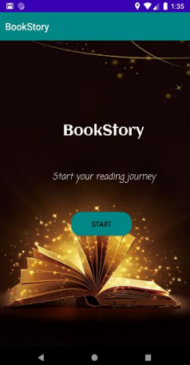
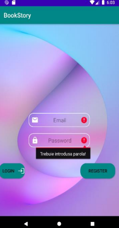
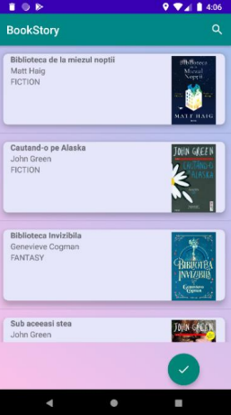
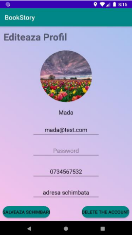
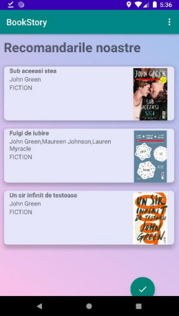

The app allows the user to:
* Log in /create an account

    
  
* View a list of available books to borrow and search for a specific book

* View / Change his own profile data

  
* Mark books for borrowing
* See the history of the book lends he made
* See a list of reccomended books based on his previous lendings
  
